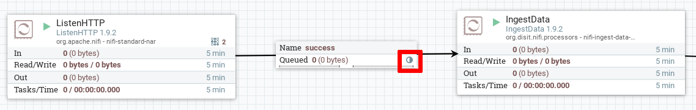

# Clustering Nifi using Snap4City Docker image

**Aim**: obtain a NiFi cluster when running the NiFi instances as Docker images on different hosts using `docker-compose` with default networking.

## Scenario
Suppose a 3-node cluster scenario where we have 3 hosts:
 * **nifi-node-1**: 192.168.1.60
 * **nifi-node-2**: 192.168.1.61
 * **nifi-node-3**: 192.168.1.62

The **nifi-node-1** host will run the whole snap4city application stack while the other hosts will only run a NiFi instance.  
**Note**: only one instance of Zookeeper will run on the host which runs the full stack (**nifi-node-1** in this scenario).

## Outline

* Get snap4city-docker repository
* Edit docker-compose.yml
* Perform setup
* Copy nifi part on the other hosts
* Reduced docker-compose.yml on hosts
* Start nifi containers
* Enable load balance

## Get snap4city-docker repository
On the **nifi-node-1** host:
```
git clone https://github.com/disit/snap4city-docker
```

## Edit docker-compose.yml

Edit `snap4city-docker/docker-compose.yml`.  
The configuration of the `nifi` service inside the compose file becomes:
```
nifi:
    image: apache/nifi:1.9.2
    hostname: nifi-node-1
    environment:
      - NIFI_WEB_HTTP_PORT=9090
      - NIFI_CLUSTER_IS_NODE=true
      - NIFI_CLUSTER_NODE_PROTOCOL_PORT=9091
      - NIFI_CLUSTER_ADDRESS=nifi-node-1
      - NIFI_ELECTION_MAX_WAIT=1 min
      - NIFI_ZK_CONNECT_STRING=192.168.1.60:2181
    ports:
      - "9090:9090" # NiFi web HTTP port
      - "9091:9091" # NiFi cluster protocol port
      - "6342:6342" # NiFi cluster load balance port
    extra_hosts:
      - nifi-node-1:192.168.1.60
      - nifi-node-2:192.168.1.61
      - nifi-node-3:192.168.1.62
    volumes:
      - ./nifi/extensions:/opt/nifi/nifi-current/extensions
      - ./nifi/conf:/opt/nifi/nifi-current/conf
    restart: unless-stopped
    logging:
      driver: "json-file"
      options:
        max-size: "${S4C_LOG_MAX_SIZE:-100m}"
        max-file: "${S4C_LOG_MAX_FILE:-10}"
```

In particular:  
#### Hostname
* `hostname: nifi-node-1` gives an explicit hostname to the container, this avoid conflicts when Jetty binds the ports for the UI web server. **Do NOT use** the host ip as hostname, otherwise Jetty will fail.

#### Env
The environment variables:  
  * `NIFI_CLUSTER_IS_NODE=true`
  * `NIFI_CLUSTER_NODE_PROTOCOL_PORT=9091` sets the port `9091` for the inter-cluster communication.
  * `NIFI_CLUSTER_ADDRESS=nifi-node-1` set the node address inside the cluster. **USE** the hostname.
  * `NIFI_ZK_CONNECT_STRING=192.168.1.60:2181` set the connection string for the Zookeeper instance using the ip of the **nifi-node-1** host.

#### Ports
 * Maps `9090` for the web server HTTP requests.
 * Maps `9091` for cluster inter-cluster communication.
 * Maps `6342` for cluster load balance.

#### Extra Hosts
The `extra_hosts` options specifies additional entries in the `/etc/hosts` file inside the containers mapping the hostnames to the host ips:
```
192.168.1.60    nifi-node-1
192.168.1.61    nifi-node-2
192.168.1.62    nifi-node-3
```

## Snap4City setup
Perform the snap4city setup in order to generate the truststore in `snap4city-docker/DataCity-Small`.

```
cd snap4city-docker/DataCity-Small

# setup directories write permissions and sets vm.max_map_count=262144 for elasticsearch
# consider adding this option into /etc/sysctl.conf otherwise have to be set after each reboot
./setup.sh
```

Now **nifi-node-1** host should be ready to run the snap4city stack including a Zookeeper instance and a NiFi instance.

By running, inside the `snap4city-docker` folder:
```
sudo docker-compose up -d
```
a 1-node NiFi cluster should be created in the snap4city application stack.


## Copy NiFi on hosts
The **nifi-node-1** host is ready to run the snap4city stack including a Zookeeper instance and a NiFi instance.

To run NiFi on **nifi-node-2** and **nifi-node-3** we need to copy only the nifi files from **nifi-node-1** and use a reduced `docker-compose.yml` specifying only the nifi service.

On **nifi-node-2** and **nifi-node-3** create a folder:
```
mkdir snap4city-nifi
```

Copy the folder `snap4city-docker/DataCity-Small/nifi` from **nifi-node-1** to `snap4city-nifi` on **nifi-node-2** and **nifi-node-3**.

The folder layout on the **nifi-node-2** and **nifi-node-3** hosts should looks like:

```
snap4city-nifi
          └── nifi
              ├── conf
              │   ├── archive
              │   │   └── ...
              │   ├── authorizers.xml
              │   ├── bootstrap.conf
              │   ├── bootstrap-notification-services.xml
              │   ├── enrich-data.conf
              │   ├── flow.xml.gz
              │   ├── logback.xml
              │   ├── login-identity-providers.xml
              │   ├── nifi.properties
              │   ├── nifi.properties.old
              │   ├── state-management.xml
              │   ├── trust-store.p12
              │   └── zookeeper.properties
              ├── extensions
              │   ├── nifi-enrich-data-nar-1.9.2.nar
              │   ├── nifi-enrichment-source-client-service-api-nar-1.9.2.nar
              │   ├── nifi-ingest-data-nar-1.9.2.nar
              │   ├── nifi-oauth-token-provider-service-nar-1.9.2.nar
              │   ├── nifi-ownership-client-service-nar-1.9.2.nar
              │   ├── nifi-resource-locator-services-nar-1.9.2.nar
              │   └── nifi-servicemap-client-services-nar-1.9.2.nar
              └── flow.xml.gz

```
we also need to give write permissions:
```
chmod a+w snap4city-docker/nifi/conf
chmod a+w snap4city-docker/nifi/extensions
```

## Reduced docker-compose.yml file on hosts
On **nifi-node-2** and **nifi-node-3** create the `snap4city-nifi/docker-compose.yml` file containing the definition for the NiFi service only and changing the configurations according to the hostnames.  
In particular:
  * `hostname: <hostname>`
  * The environment variable: `NIFI_CLUSTER_ADDRESS=<hostname>`

The compose file on these hosts also needs additional hosts mappings to match the endpoints configured inside the nifi flow.  
Using the `extra_hosts` configuration in the compose file we need to map the hostnames:
* dashboard
* opensearch-n1
* kafka

to the ip of the host which runs the full snap4city application stack (192.168.1.60 in this case).

For example on **nifi-node-2** the full `docker-compose.yml` file:
```
version: "3"
services:
  nifi:
    image: apache/nifi:1.9.2
    hostname: nifi-node-2
    environment:
      - NIFI_WEB_HTTP_PORT=9090
      - NIFI_CLUSTER_IS_NODE=true
      - NIFI_CLUSTER_NODE_PROTOCOL_PORT=9091
      - NIFI_CLUSTER_ADDRESS=nifi-node-2
      - NIFI_ELECTION_MAX_WAIT=1 min
      - NIFI_ZK_CONNECT_STRING=192.168.1.60:2181
    ports:
      - "9090:9090" # NiFi web HTTP port
      - "9091:9091" # NiFi cluster protocol port
      - "6342:6342" # NiFi cluster load balance port
    extra_hosts:
      # Mapping for the nifi cluster
      - nifi-node-1:192.168.1.60
      - nifi-node-2:192.168.1.61
      - nifi-node-3:192.168.1.62

      # Mapping to match the endpoints in the nifi flow
      - dashboard:192.168.1.60
      - opensearch-n1:192.168.1.60
      - kafka:192.168.1.60
    volumes:
      - ./nifi/extensions:/opt/nifi/nifi-current/extensions
      - ./nifi/conf:/opt/nifi/nifi-current/conf
    restart: unless-stopped
    logging:
      driver: "json-file"
      options:
        max-size: "${S4C_LOG_MAX_SIZE:-100m}"
        max-file: "${S4C_LOG_MAX_FILE:-10}"
```

## Start nifi containers
If the snap4city stack is not already running on **nifi-node-1**:
```
cd snap4city-docker
sudo docker-compose up -d
```

On **nifi-node-2** and **nifi-node-3** hosts:
```
cd snap4city-nifi
sudo docker-compose up -d
```

When all container are up and running the nifi instances should form a 3-node cluster.

## Enable load balance
Since the only node receiving the messages from the context broker is the node which runs the full snap4city application stack (**nifi-node-1** in this example), to distribute the workload across the cluster we need to enable the load balancing inside the nifi flow.

It is sufficient to enable the load balancing on the queue which connects the `ListenHTTP` processor to the `IngestData` processor.

To do this:
* access the nifi web UI using through:
```
http://nifi:9090/nifi
```

* stop the `ListenHTTP` and `IngestData` processor in order to enable the queue configuration.
* right click on the queue then `Configure` -> `Settings tab`
* select a load balance strategy for the configuration `Load Balance Strategy`.
* start the `ListenHTTP` and `IngestData` processors.

The full-half circle icon on the queue indicates that the load balancing is enabled on such queue:



## Notes
To scale up the cluster we need to edit the `docker-compose.yml` file on every host to update the `extra_hosts` property and restart every NiFi container in the cluster.
