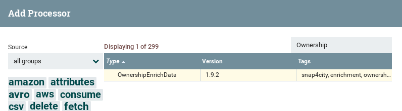
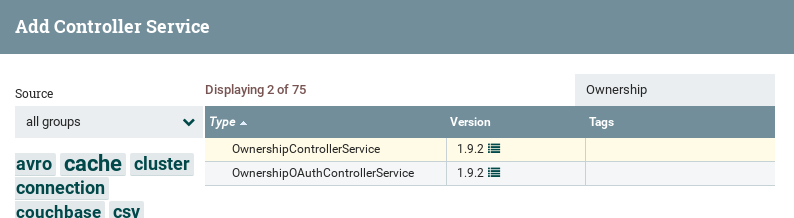
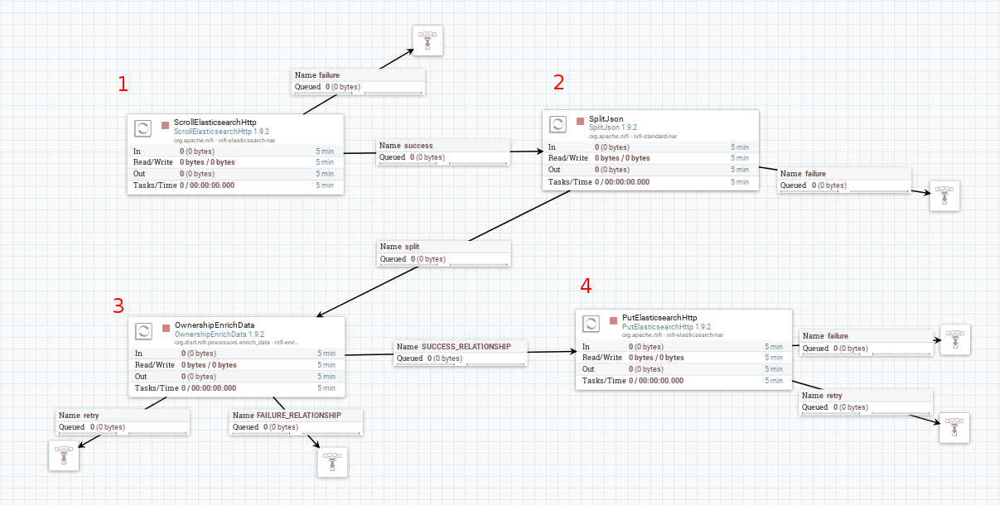
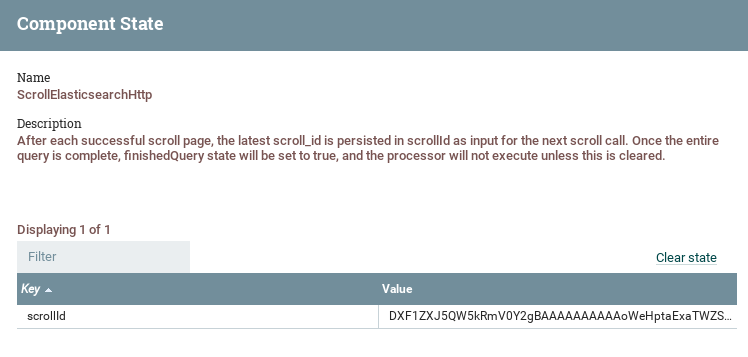
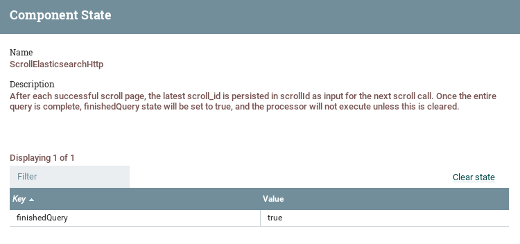
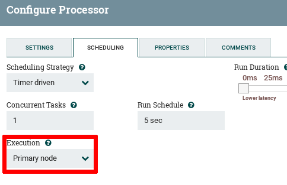
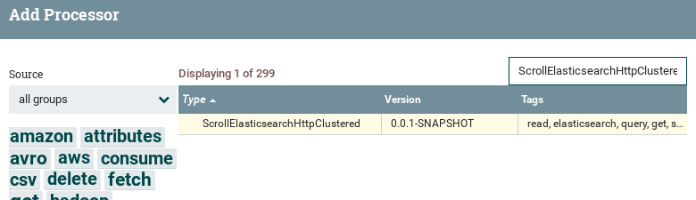
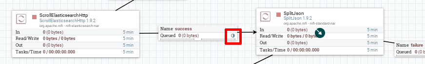

# Ownership re-index Guide

**Scope**: re-index data from an Elasticsearch/Opensearch index to another while enriching with ownership fields.

In this scenario we suppose a an index containing documents indexed throught the Snap4City infrastructure and such documents doesn't contain the fields relative to the ownership of the sensors.

The aim is to re-index these documents, while performing the enrichment relative to the ownership fields only, to a different index (on the same or different Elasticsearch cluster).

## Outline
* OwnershipEnrichData processor
* Nifi reindex-flow setup
* Nifi cluster setup
* Elasticsearch settings

### Scenario
We suppose an Elasticsearch instance running on a machine with IP address `192.168.1.50` using standard Elasticsearch service port `9200`.  
With an index named **old-index** which contains documents without the ownership-related fields, for example:
```
{
    "type": "float",
    "value": 10.8,
    "metadata": {},
    "different_values": "0",
    "value_bounds": "unspecified",
    "value_type": "PM10_concentration",
    "data_type": "float",
    "value_refresh_rate": "300",
    "value_unit": "ppm",
    "attr_type": "DeviceAttribute",
    "id": "sensor1",
    "latlon": "60.157337,24.91201",
    "serviceUri": "http://serviceuriprefix.org/sensor1",
    "uuid": "9b1d9a82-f014-4314-b215-c3de4b6d383b",
    "value_name": "PM10",
    "date_time": "2022-02-08T18:23:49.846Z",
    "date_time10min": "2022-02-08T18:20:00.000Z",
    "date_time10sec": "2022-02-08T18:23:50.000Z",
    "date_time1d": "2022-02-08T00:00:00.000Z",
    "date_time1h": "2022-02-08T18:00:00.000Z",
    "date_time1min": "2022-02-08T18:23:00.000Z",
    "date_time1sec": "2022-02-08T18:23:49.000Z"
}
```

After the re-index, the documents will contain the fields:
* **user**
* **group**
* **delegatedUsers**
* **delegatedGroups**

As in the Snap4City architecture these informations are retrieved from the ownership service throught the endpoint:
```
http://<ownership service URL>?elementId=<BROKER>:<ORGANIZATION>:<SENSOR_ID>
```

in this guide we assume the ownership service located on the same host available using the port `8090`:
```
http://192.168.1.50:8090/ownership?elementId=<BROKER>:<ORGANIZATION>:<SENSOR_ID>
```

we assume that the `sensor1` ownership data can be retrieved using the identifier:
```
elementId=broker:organization:sensor1
```

The expected response is a JSON object containing:
```
{
    "username": "ownerUser",
    "usr_delegations": [
        "delegatedUser1",
        "delegatedUser2"
    ],
    "group": "ownerGroup",
    "grp_delegations": [
        "delegatedGroup1",
        "delegatedGroup2"
    ],
    ...
}
```

The final documents in the new index will look like:
```
{
    "type": "float",
    "value": 10.8,
    "metadata": {},
    "different_values": "0",
    "value_bounds": "unspecified",
    "value_type": "PM10_concentration",
    "data_type": "float",
    "value_refresh_rate": "300",
    "value_unit": "ppm",
    "attr_type": "DeviceAttribute",
    "id": "sensor1",
    "latlon": "60.157337,24.91201",
    "serviceUri": "http://serviceuriprefix.org/sensor1",
    "uuid": "9b1d9a82-f014-4314-b215-c3de4b6d383b",
    "value_name": "PM10",
    "date_time": "2022-02-08T18:23:49.846Z",
    "date_time10min": "2022-02-08T18:20:00.000Z",
    "date_time10sec": "2022-02-08T18:23:50.000Z",
    "date_time1d": "2022-02-08T00:00:00.000Z",
    "date_time1h": "2022-02-08T18:00:00.000Z",
    "date_time1min": "2022-02-08T18:23:00.000Z",
    "date_time1sec": "2022-02-08T18:23:49.000Z",
    "user": "ownerUser",
    "delegatedUsers": ["delegatedUser1","delegatedUser2"],
    "group": "ownerGroup",
    "delegatedGroups": ["delegatedGroup1","delegatedGroup2"]
}
```

## OwnershipEnrichData processor

The [EnrichData NiFi bundle](https://github.com/disit/snap4city/tree/master/NIFI-processors/enrich-data) provides a special processor tied to this purpose: **OwnershipEnrichData**.  
This processor should be present among the available processors in NiFi, if the EnrichData bundle is correctly installed:



This processor is a reduced version of the EnrichData processor which performs only the enrichment part relative to the ownership fields.  

It relies only on a `OwnershipControllerService` or `OwnershipOAuthControllerService` to retrieve the ownership data, available by installing the EnrichData bundle:



## Nifi reindex flow setup
The setup described in this section assumes a **single Nifi node** to perform the re-index.  
The setup in the clustered case is described in the [Nifi cluster setup](#nifi-cluster-setup) section but assumes this section as baseline.

The dataflow is the following:


1. **ScrollElasticsearchHttp** : reads the documents from **old-index** by scrolling through an Elasticsearch query, the results are paged and each page of results is returned wrapped in a JSON object like `{"hits":[<doc_1>, ... , <doc_n>]}` inside the flow file content.  

2. **SplitJson** is needed to split the JSON object returned by the scroll into flow files containing a single document.  

3. **OwnershipEnrichData** : performs the enrichment with the ownership fileds.

4. **PutElasticsearchHttp** : index the documents in the **new-index**.

The funnels are used as "dead-ends" to collect the failed flow files.

### Processors Configurations

### 1. ScrollElasticsearchHttp

##### Properties
The relevant configurations for this processors are:
* **Elasticsearch URL**: `<scheme>://<elasticsearch URL>:<port>` (in this case `http://192.168.1.50:9200`).  

* **Query** : `*:*` (matches all documents in the index)  

* **ScrollDuration** : the processor scrolls through the specified query by paging the results and putting a single page inside the content of a flow file. To remember the "checkpoint" of the scroll it keeps in memory the scroll_id.  
The 'Scroll Duration' property specifies how long this id is kept in memory, by default this can be set to a relatively short period like the default `1m`.   
This assumes that the following dataflow part can keep up with the read rate, which probably is not the case because it involves potentially time consuming operations: a JSON split, an HTTP request to retrieve the ownership data followed by a JSON manipulation and a final HTTP request to index the documents.  
This means that we need to slow down the read rate by using a schedule to wait between two task executions, for example if we set the `Run Schedule` to `2m` with `1m` of 'Scroll Duration' the scroll_id will be lost and the processor will fail, or if we stop the processor for an amount of time greater than 'Scroll Duration' the scroll_id is lost as well.  
A reasonable setting can be `30m`/`1h` if you plan to stop the processor.

* **Page Size**: is the number of documents per page, this parameter depends on the memory available because the processor will read the documents in memory before witing them to a Flow File.  
The maximum number of documents per page allowed by Elasticsearch is `10000`.

* **Index**: the index to read from (in this case **old-index**).

##### Scheduling
* **Scheduling Strategy** : time driven.
* **Concurrent Tasks** : 1 (otherwise we get document duplication).
* **Run Schedule** : depends on the following dataflow processors speed and **Page Size**. You need to tune this setting to avoid to fill the queues, you can start from `5s` and increase/decrease.
* **Execution**: for a single Node this is not relevant but this processor is designed to be run on a single node i.e. the 'Primary node' (more on this in the [Nifi cluster setup](#nifi-cluster-setup) section).

##### State
This processor stores the state i.e. the scroll_id in memory.  
The state can be inspected by `Right click on processor` -> `View state`.



When the processor has scrolled through all the query documents the state is:



To restart the scroll operation, after stopping the processor, use the `Clear state` button to clear the state.

### 2. SplitJson

##### Properties
The relevant configuration is:
* **JsonPathExpression** : `hits`  
(this will extract the documents from the 'hits' array and split them in single flow files).

##### Scheduling
* **Concurrent Tasks** : you can increase the concurrent tasks to split different pages in parallel (depends on the capabilities of the machine).

### 3. OwnershipEnrichData

##### OwnershipControllerService
This processor relies on a `OwnershipControllerService` (or its OAuth version `OwnershipOAuthControllerService`).  
First we need to create such controller service with the following configuration:
* **Ownership API Url** : `http://192.168.1.50:8090/ownership` (in this example).
* **ElementId name** : `elementId`
* **ElementId prefix** : `broker:organization:`
* **Ownership Fields** : `username,usr_delegations,group,grp_delegations` (specifies a the set of fields to retrieve from the ownership response)
* **Fields mapping** : `{"username":"user","usr_delegations":"delegatedUsers","grp_delegations":"delegatedGroups"}` (remap the ownership properties with the desired names).

The OAuth version needs an `OAuthTokenProviderService` to retrieve the access tokens.

In this example the controller service is named `MOCK_OwnershipOAuthControllerService`.

##### Properties

* **Ownership Client Service**: use the dropdown menu to select the newly created OAuthControllerService (`MOCK_OwnershipControllerService` in our example)

* **Device Id Name** : `id`

* **Use default properties on onwership error**: if **false** the processor skips the enrichment if the ownership data cannot be correctly retrieved from the ownership service, if **true** it uses the **Default ownership properties** to perform the enrichment.  

* **Default ownership properties** (optional) : these fields are used if the processor is configured to use the default properties in case of error during the retrieval of the sensor ownership. It must be a JSON object like:
```
{
    "user":"DEFAULT_USER" ,
    "group":"DEFAULT_GROUP" ,
    "delegatedUsers":[],
    "delegatedGroups":[]
}
```

* **Additional default ownership properties** (optional) : the fields specified in this configuration are inserted if not present in the response from the ownership service. This is useful when we want the new documents to always have a value for a given property.  
For example if we want the new documents to have always a value for the `group` field we can set this property to:
```
{ "group" : "DEFAULT_GROUP" }
```
if the ownership response does not contain a `group` field, `"group":"DEFAULT_GROUP"` is used.
(**NOTE**: this property does not apply in case of failure from the ownership service, in that case only the set of fields specified by **Default ownership properties** is used)

* **Purge existing properties** (optional) : a comma separated list of properties to remove from the documents before the ownership enrchment.

##### Scheduling

To achieve more speed is recommended to increase the number of concurrent tasks.  
This processor can potentially be a bottleneck due to the number of operations involved and it should try to exploit the parallelism more over the other processors.

### 4. PutElasticsearchHttp

This processor must be configured to index the new documents in a new index (**new-index** in this example).

##### Properties
Relevant configurations:
* **Elasticsearch URL** : `http://192.168.1.60:9200` (we assume to re-index the documents on the same Elasticsearch cluster).

* **Connection timeout** : `5 secs` (Default, increase as needed)

* **Response timeout** : `15 secs` (Default, increase as needed)

* **Index** : `new-index`

* **Type** : `_doc`

* **Batch Size** : preferred number of documents to index in a single transaction. The default value is `100` but you should try to match the value of the **Page Size** property of the **ScrollElasticsearchHttp** processor in order to balance the read/write rates.

* **Operation** : `index`

##### Scheduling
If during the re-index the flow file accumulates in the input queue of this processor and Elasticsearch is not slow in the indexing process, you can increase the number of concurrent tasks of this processor.


## Nifi cluster setup
Ideally the reads and writes from and to Elasticsearch are reasonably fast, but the enrchiment could lead to backpressure and flow file accumulations in the queues.

The re-index operation using a cluster is highly beneficial in terms of speed because the horizontal scaling of the **OwnershipEnrichData** processor helps to avoid a bottleneck in the enrichment operations.

When using a cluster the flow setup is the same described in [Nifi reindex flow setup](#nifi-reindex-flow-setup), but with two differences:
* The **ScrollElasticsearchHttp** is not guaranteed to work properly.
* Use of the **load balancing** to distribute the work across the cluster.

### ScrollElasticsearchHttpClustered

From the **ScrollElasticsearchHttp** documentation:  
```
This processor is intended to be run on the primary node,
and is designed for scrolling through huge result sets,
as in the case of a reindex.
```

If we run the processor on multiple nodes we get documents duplications because each node will run an independent scroll.  
This time we need to explicitly set in the `Scheduling` tab:


Now the processor is scheduled to run on the primary node only, but there is still a subtle problem: we cannot assure that the primary node will be the same during the whole re-indexing process. **The primary node can change**.

This is likely to happen especially when the index is big and the flow needs to run for a day or two before finishing.

What happens:
  1. At the beginning the processor runs on **node-1**.
  2. The primary node changes from **node-1** to **node-2**.
  3. The processor is scheduled to run on **node-2**.
  4. Since the scroll_id is kept in memory on **node-1**, the new primary node has no scroll_id to resume the scroll and it starts a new scroll.

Consequences:
  * The operations before the primary node switch are virtually lost and the re-indexing process is restarted.
  * We have data duplication in the **new-index**.

To avoid this problem the [custom-elasticsearch bundle]() (not published yet) bundle provides an edited version of the **ScrollElasticsearchHttp** which saves the scroll_id on the cluster coordinator (Zookeeper) to maintain the information after a primary node switch.  
Such processor is called **ScrollElasticsearchHttpClustered**, available by installing the [custom-elasticsearch bundle]()(not published yet):



Use this processor, with the same settings, instead of the standard ScrollElasticsearchHttp in a cluster setup.

### Load balancing
Since the **ScrollElasticsearchHttp** runs on the primary node, to split the work across the cluster you need to configure the load balancing.  
The load balancing should be set on the queue immediately after the ScrollElasticsearchHttp processor in order to distribute the SplitJson, OwnershipEnrichData and PutElasticsearchHttp executions over the cluster.



## Elasticsearch settings

The **new-index** can be tuned to improve the indexing speed during the re-index process:
 * [Unset or increase the refresh interval](https://www.elastic.co/guide/en/elasticsearch/reference/7.0/tune-for-indexing-speed.html#_unset_or_increase_the_refresh_interval)  
 Configurable by:
 ```
 PUT /new-index/_settings
 {
    "index":{
      "refresh_interval":"<new value>"
    }
 }
 ```
  The default value is `1s`, to unset use `-1`.

 * [Disable refresh and replicas for initial load](https://www.elastic.co/guide/en/elasticsearch/reference/7.0/tune-for-indexing-speed.html#_disable_refresh_and_replicas_for_initial_loads)
 Configure using:
 ```
 PUT /new-index/_settings
 {
    "index":{
      "refresh_interval":"-1",
      "number_of_replicas":0
    }
 }
 ```

When the re-index process is finished remember to reset back or tune these configurations.  
In particular set the refresh interval to see the new documents.
